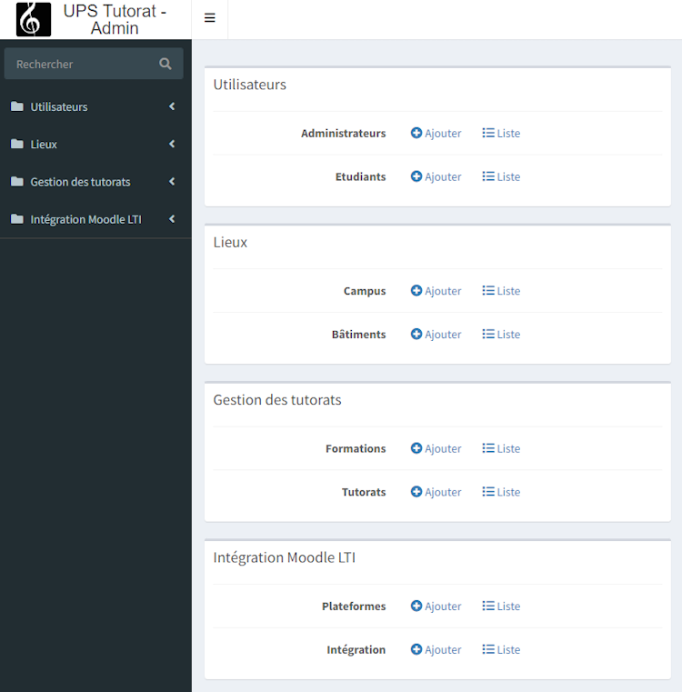
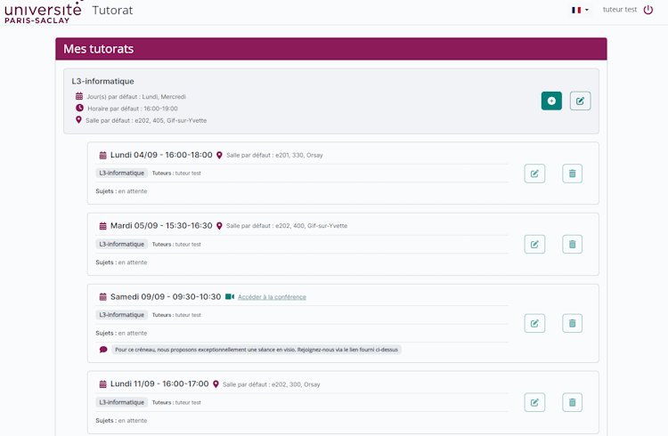
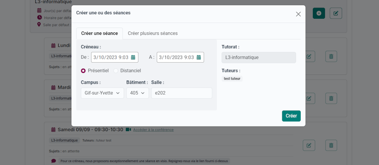
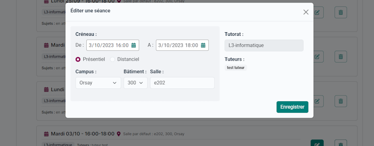
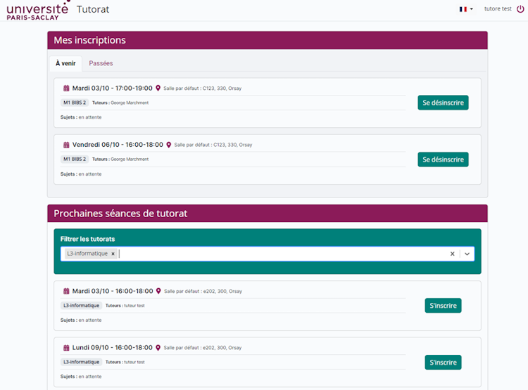

---
hide:
    - navigation
---

## Présentation

> Tutorat est un projet open-source permettant d'une part de créer et gérer des créneaux de tutorats, et d'autre part côté étudiant de pouvoir s'y inscrire.

## Administrateurs

Les administrateurs peuvent :

-   Gérer la liste des tuteurs (gestionnaires de créneaux)
-   Gérer la liste des lieux (campus, bâtiments)
-   Gérer la liste des formations (type de créneaux) et tutorats (type de créneaux pour une année académique) et leur associer des tuteurs
-   Paramétrer l'outil pour en faire une activité disponible sur moodle via connexion LTI.

<figure markdown>
  { width="750" }
  <figcaption>Vue de l'admin</figcaption>
</figure>

## Tuteurs

Les tuteurs (gestionnaires) peuvent :

-   Créer des créneaux à l'unité ou par lot
-   Les modifier (date, heures, lieu)
-   Les supprimer
-   Bientôt : Les compléter avec des sujets de séance, documents, etc
-   Bientôt : indiquer et consulter les heures réalisées dans le cadre des tutorats

<figure markdown>
  { width="750" }
  <figcaption>Vue de l'interface des tuteurs. Chaque tuteur voit les tutorats auquel il est lié, et peut intervenir sur les créneaux pour les créer ou les éditer.</figcaption>
</figure>

<figure markdown>
  { width="750" }
</figure>

<figure markdown>
  { width="750" }
</figure>

## Étudiants

Les tutorés (étudiants) peuvent :

-   Visualiser et filtrer les créneaux en fonction des filtres choisis
-   S'y inscrire
-   Voir les créneaux où ils sont inscrits
-   Bientôt : réagir aux sujets de séance proposés par les tuteurs, consulter les documents proposés

<figure markdown>
  { width="750" }
  <figcaption>Vue de l'interface des étudiants. On y retrouve les créneaux où l'étudiant est inscrit, et la liste des créneaux disponibles filtrables par formation.</figcaption>
</figure>

Ce code a été utilisé par l'[Université Paris-Saclay](https://www.universite-paris-saclay.fr/) pour mettre en œuvre le [projet TutorIA](https://tutoria.universite-paris-saclay.fr/accueil)

<figure markdown>
  
</figure>

<figure markdown>
  [Contactez nous](mailto:contact.opensource@centralesupelec.fr){ .md-button }
  [Slides de présentation](assets/Tutorat-présentation.pdf){ .md-button }
</figure>
